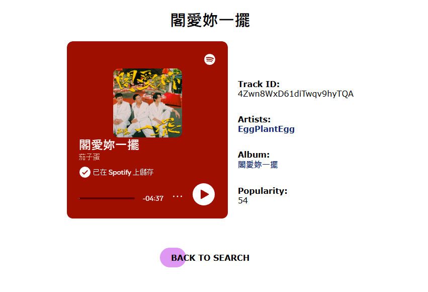

# Spotify Web API

This is a project utilizing the Spotify Web API, allowing users to query and retrieve music data from Spotify. The project is built using Node.js and the Express framework, leveraging Spotify's RESTful services for data retrieval.

<div style="text-align: center;">
    
    
</div>

## Folder Contents

- **server.js**: Server-side HTML generation where your Node.js server constructs and returns complete HTML pages.
- **spotifyApi.js**: An object-oriented proxy that reads from Spotify’s RESTful services.
- **error.js**: Error control definitions.
- **package.json**: Dependency configuration file for the project.
- **public**: Static HTML and CSS files.

## Features

This project provides various functionalities, including:

1. **Album Search**:
   - Users can search for albums based on keywords, displaying album covers, names, artists, release dates, and track counts.

2. **Track Search**:
   - Users can search for tracks, showing track names, artists, albums, durations, and popularity scores.

3. **Artist Search**:
   - Users can search for artists, displaying artist images, names, genres, and popularity ratings.

4. **Album Details**:
   - Users can view detailed information about albums, including album covers, artists, genres, release dates, and track listings.

5. **Track Details**:
   - Users can view detailed information about tracks, including an embedded playback frame, IDs, artists, and album information.

6. **Top Tracks of an Artist**:
   - Users can view a list of an artist's top tracks, showing each track's name, album, and popularity.

## Usage

1. Install Node.js.
2. Install the dependencies listed in `package.json`
```
npm install
```
3. Fill out Spotify **Client ID** & **Client secret** in `server.js`
4. Server boost:
```
npx nodemon server.js
```

- **Spotify Document for Web API:** [Spotify Web API Documentation](https://developer.spotify.com/documentation/web-api)
- **Instructions:** [HW 5](https://ee547.usc-ece.com/static/hw/05/hw5-ee547-25sp.pdf), [HW 6](https://ee547.usc-ece.com/static/hw/06/hw6-ee547-25sp.pdf)
